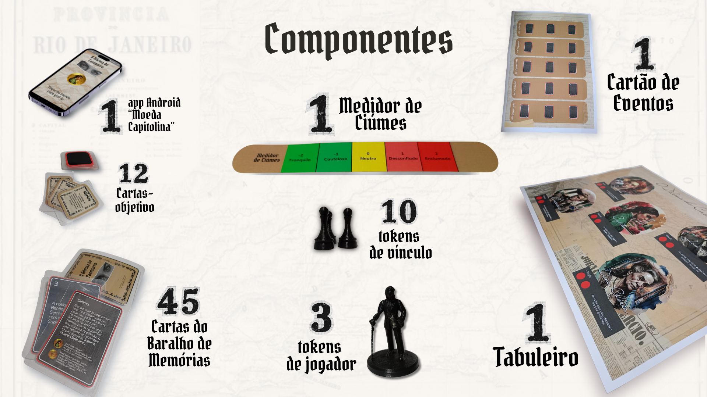
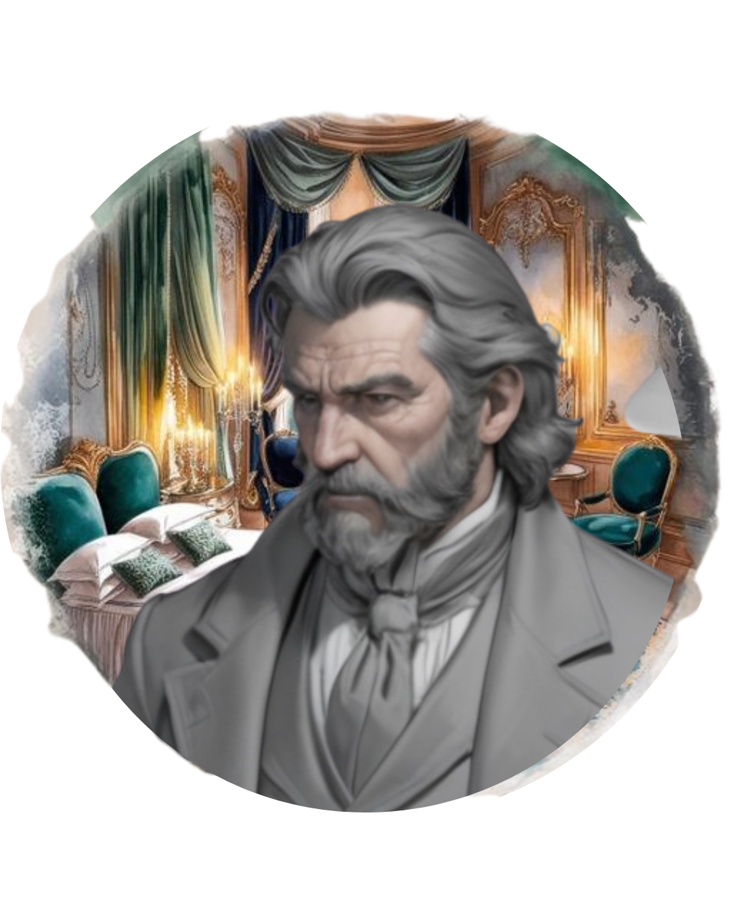
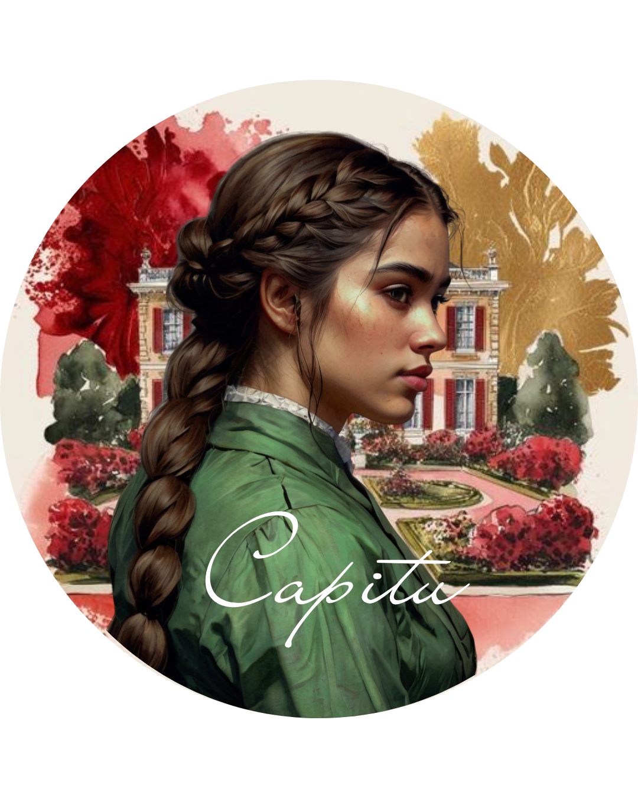
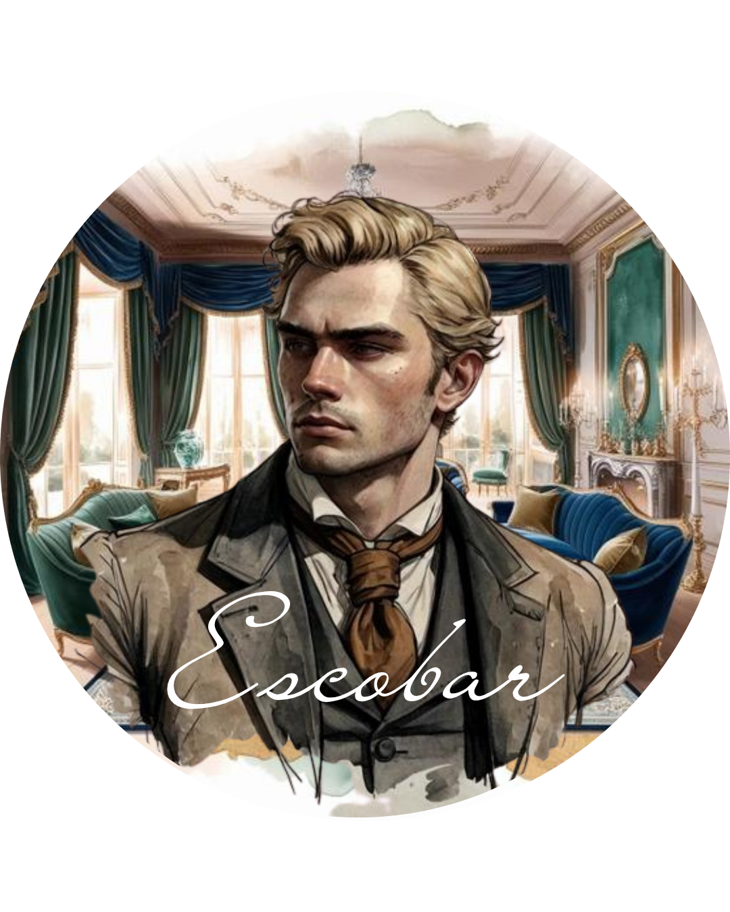
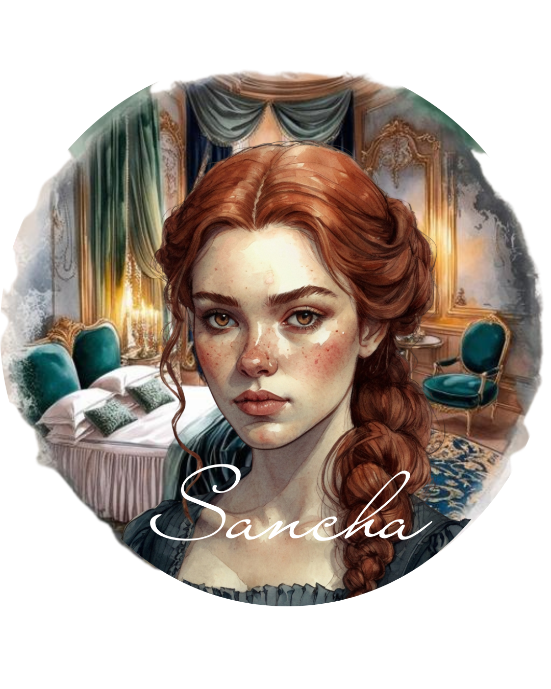
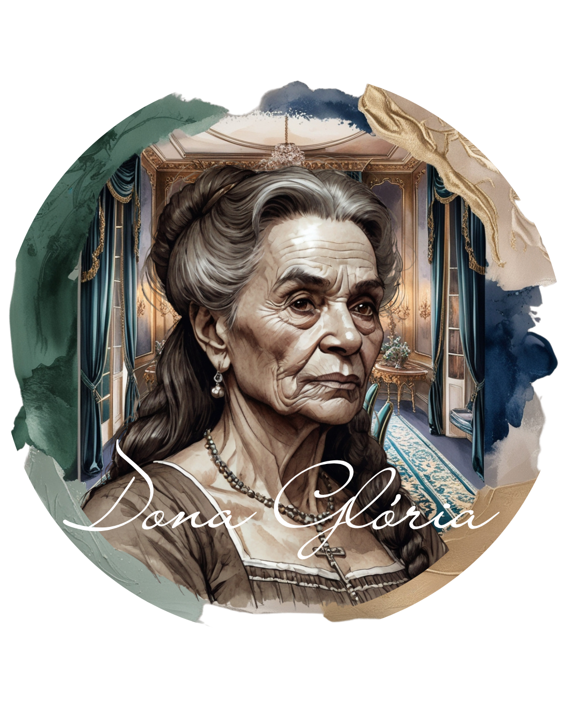
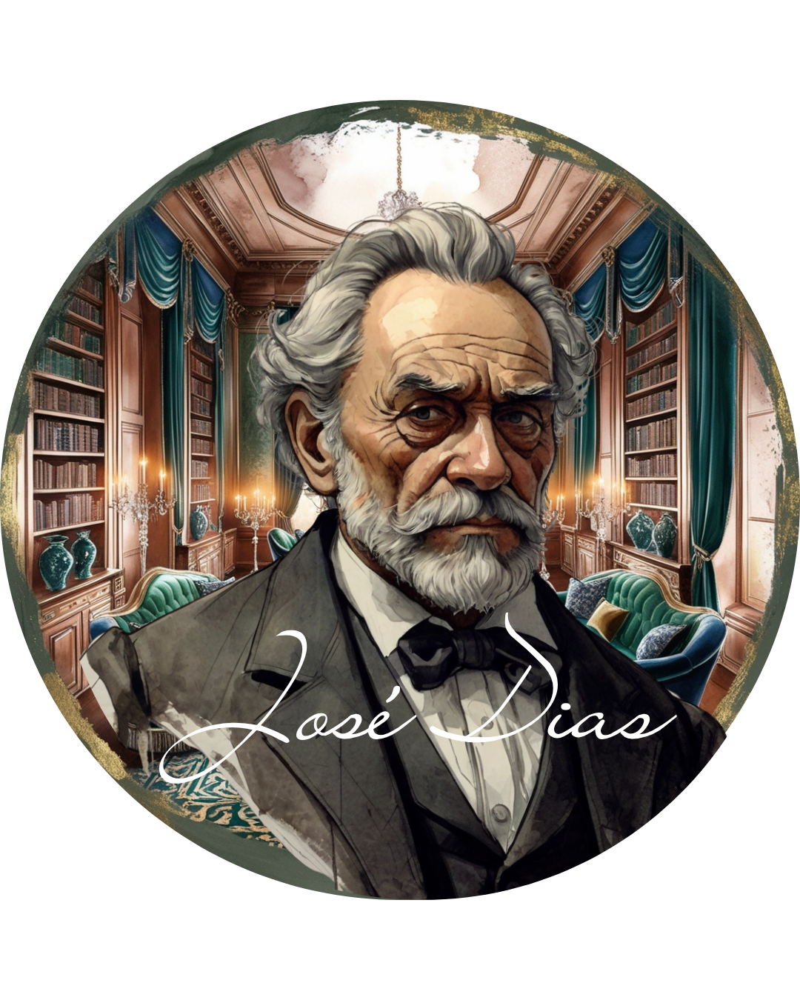

  

  # O DILEMA DE CASMURRO

  *Um board game investigativo sobre memória, ciúme e a obra de Machado de Assis.*

  
  
 

---

## 📖 A Premissa e o Propósito Educacional

*"Permita-me compartilhar uma novidade que, creio, lhe há de interessar. Tenho em minhas mãos um jogo peculiar, O Dilema de Casmurro, que promete não apenas entretenimento, mas uma viagem através das brumas da memória e das emoções que me atormentaram..."* — Bento de Albuquerque Santiago.

**O Dilema de Casmurro** é um jogo de tabuleiro colaborativo e de gestão de recursos emocionais, desenhado no formato *Print & Play*. Mais do que uma adaptação literária, o projeto é uma intervenção pedagógica alinhada à Base Nacional Comum Curricular (BNCC). O jogo foi projetado para desenvolver competências gerais como o pensamento crítico, a argumentação e a empatia, além de promover a resolução de problemas e a cooperação entre os jogadores.

---

## 📦 Componentes do Jogo

  

Para iniciar a sua jornada pelas memórias de Bentinho, você precisará imprimir e organizar os seguintes itens:
* 1 Tabuleiro com 5 casas.
* 1 Medidor de Ciúmes.
* 45 Cartas do Baralho de Memórias.
* 12 Cartas-objetivo.
* 1 Cartão de eventos.
* 3 tokens de jogador e 10 tokens de vínculo.
* **Moeda Capitolina:** Um aplicativo Android de apoio (Companion App).

---

## ⚙️ Visão Geral das Regras (Core Loop)

**Objetivo:** Os jogadores devem visitar personagens para resgatar memórias, fortalecer vínculos e gerenciar o medidor de ciúmes. Para vencer, um jogador deve satisfazer o objetivo descrito em sua carta-objetivo. Todos perdem se o medidor de ciúmes ultrapassar os limites estipado.

Cada turno é composto por duas etapas principais:

1. **Visitar um Personagem:** O jogador escolhe uma casa (personagem) para visitar. O medidor de ciúmes é ajustado de acordo com a indicação da casa (Dona Glória e Sancha diminuem o ciúme; Escobar e José Dias o aumentam). Visitar Capitu exige jogar a *Moeda Capitolina* para definir a alteração.
2. **Realizar uma Ação:** O jogador escolhe realizar apenas uma ação:
   * **Desbloquear Memória:** Comprar cartas do baralho, do descarte ou trocar com outro jogador.
   * **Configurar Vínculo:** Depositar, remover ou mover tokens de vínculo na casa visitada.

---

## Os Personagens

  
  &nbsp;&nbsp;&nbsp;
  
  &nbsp;&nbsp;&nbsp;
  
  &nbsp;&nbsp;&nbsp;
  
  &nbsp;&nbsp;&nbsp;
  
  &nbsp;&nbsp;&nbsp;
  

As interações no tabuleiro são mediadas pelas personalidades e históricos dos personagens. Cada visita desencadeia gatilhos emocionais específicos na mente de Bentinho, forçando os jogadores a equilibrarem a busca por memórias com a estabilidade psicológica do protagonista.

---

## 🛠️ Bastidores e Tecnologia

Este jogo foi desenvolvido como projeto para a disciplina de *Jogos na Educação*, parte do **Programa de Pós-Graduação em Tecnologias Educacionais em Rede (PPGTER) da UFSM**. 

A arquitetura do projeto é multidisciplinar e *phygital*, utilizando as seguintes ferramentas:
* **Design Gráfico e Diagramação:** Plataforma Canva.
* **Direção de Arte e Ilustrações:** Imagens conceituais geradas via Leonardo.Ai.
* **Desenvolvimento Mobile:** O aplicativo *Moeda Capitolina* foi programado em Kotlin nativo utilizando o Android Studio.

### 🖨️ Faça o Download e Jogue!
O manual completo e todos os arquivos necessários para impressão em alta qualidade estão disponíveis na pasta `printables` deste repositório.

➡️ **[BAIXAR O LIVRO DE REGRAS COMPLETO E ARQUIVOS (PDF)](printables/)**

---

## 👥 Autores e Ficha Técnica

* **Kauê Sitó:** Doutorando PPGL/UFSM. Mestre PPGTER/UFSM. Graduado em Letras pela UFRGS. Professor no Instituto Federal Sul-rio-grandense (IFSul), campus Sant'ana do Livramento.
* **Henrique Welter Azzi:** Mestre PPGTER/UFSM. Graduado em Gestão de Cooperativas pela UFSM. Assistente em Administração da UFSM.
